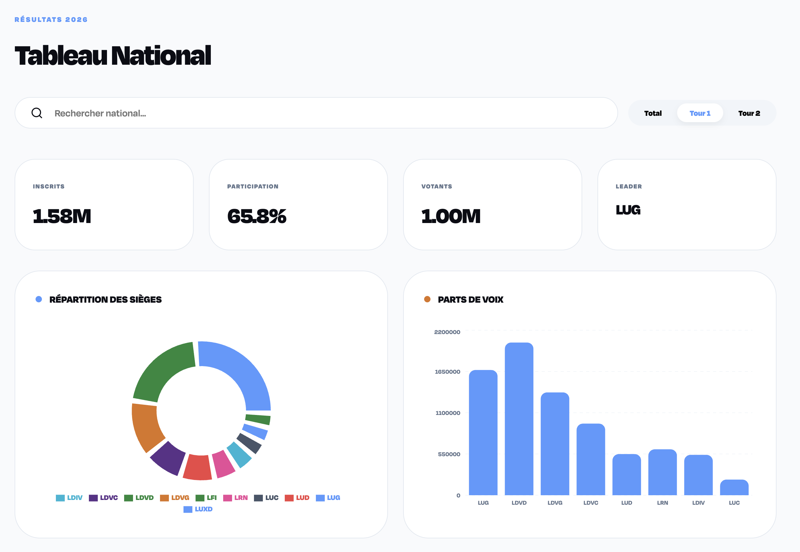
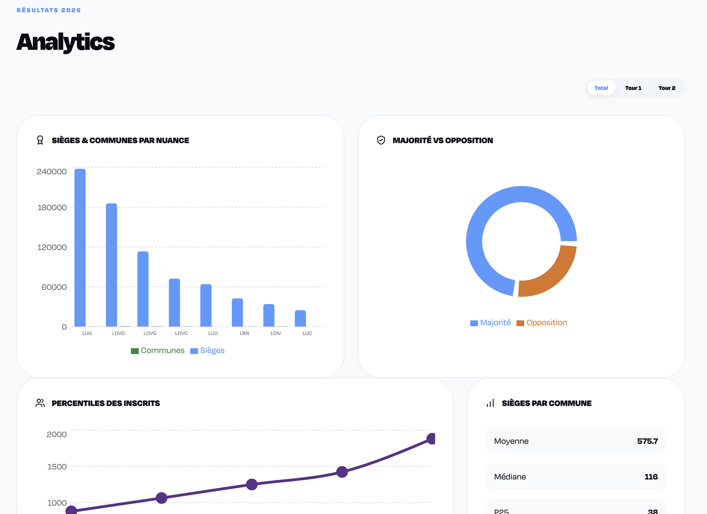
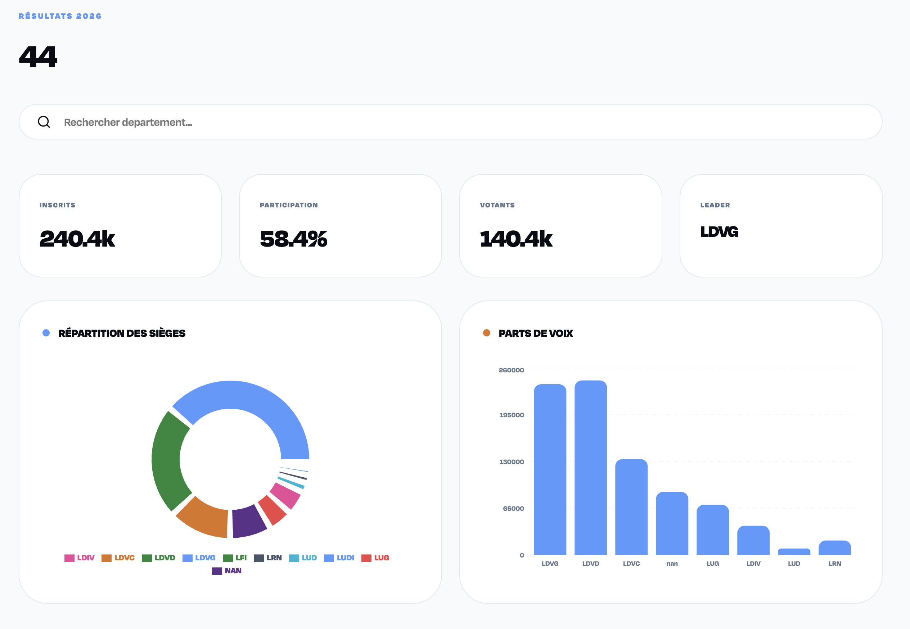
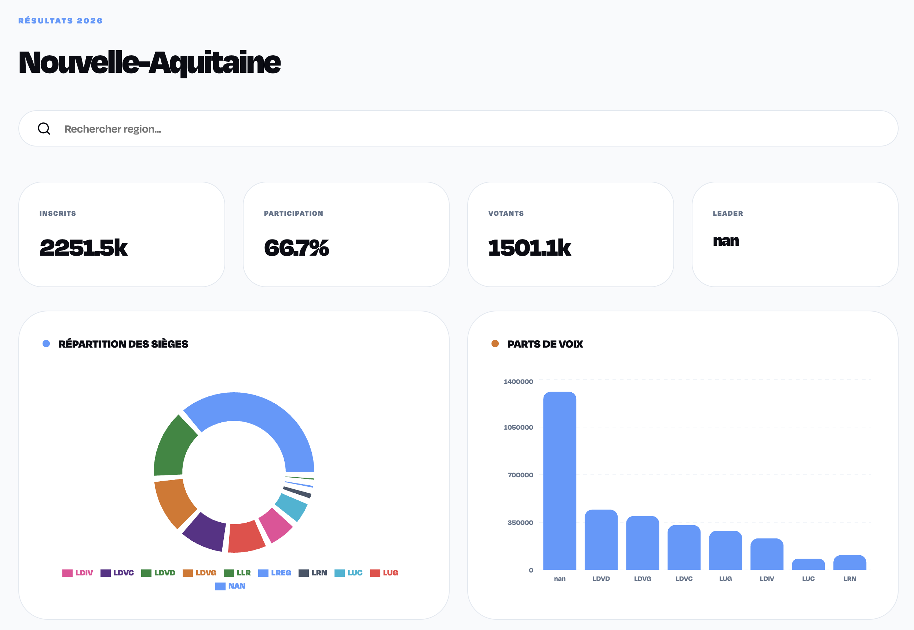
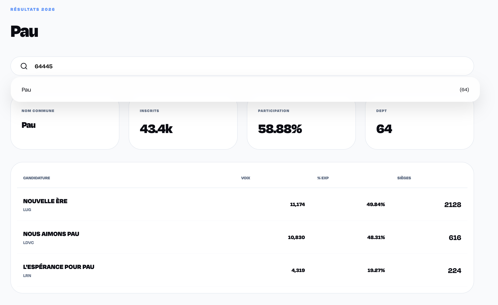

# BVFrance - Election Analytics Dashboard

Visualisation dynamique des résultats électoraux par commune, département et région. Propulsé par **DuckDB** & **CY Tech**.

## Architecture
- **Frontend** : React + Vite + Recharts + Lucide Icons (Branding CY Tech).
- **Backend** : FastAPI + Pandas + DuckDB (Analyses haute performance).
- **Data** : Fichiers Parquet stockés dans `backend/parquet/`.

---

## Lancement Rapide

### 1. Reset des ports (Optionnel)
Si les ports sont déjà utilisés, tuez-les :
```bash
lsof -t -i:3000,8000 | xargs kill -9 2>/dev/null
```

### 2. Backend (FastAPI)
```bash
cd backend
source venv/bin/activate
python -m uvicorn api:app --host 0.0.0.0 --port 8000
```
*L'API sera disponible sur http://localhost:8000*

### 3. Frontend (React)
```bash
cd frontend
npm install  # (si premiere fois)
npm run dev -- --port 3000
```
*Le Dashboard sera disponible sur http://localhost:3000*

---

## Fonctionnalités
- **National** : Vue globale avec sélecteur de tours (Total, T1, T2).
- **Géo** : Recherche par Région ou Département avec KPIs locaux.
- **Commune** : Détail des listes et sièges au niveau municipal.
- **Analytics** : Statistiques avancées (Percentiles, Moyennes, Majorité vs Opposition).

---

## Screenshots

### Vue Nationale


### Analyses Statistiques


### Vue Départementale & Régionale



### Vue Communale


---
© 2026 - CY Tech / abdemeh
